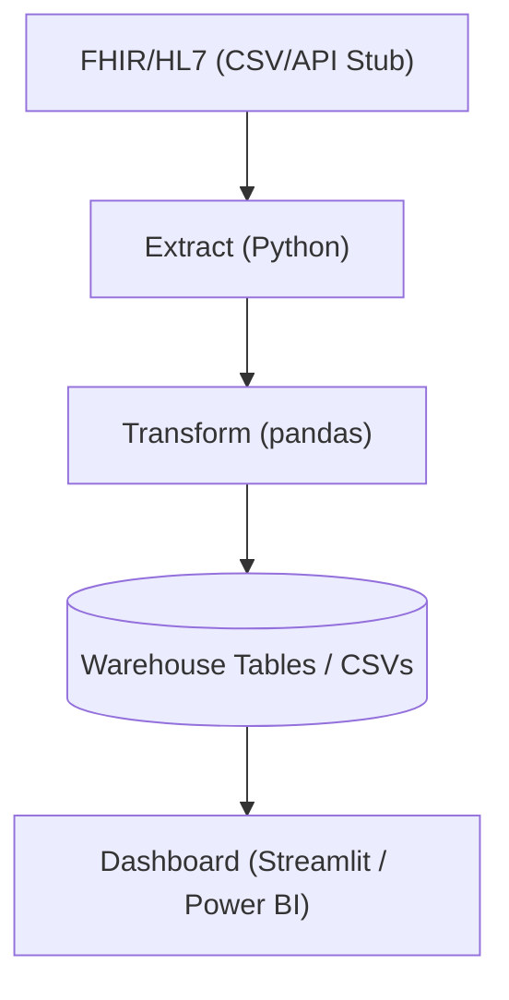
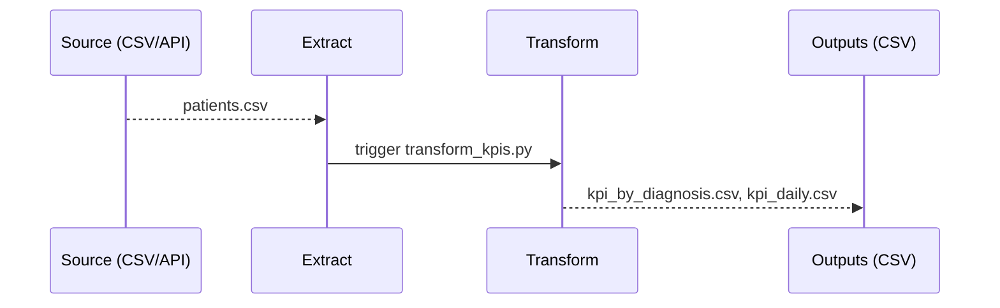
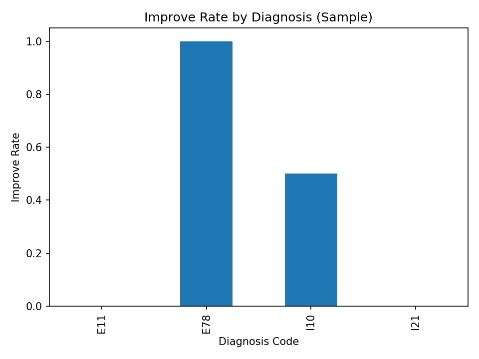

# 🏥 Patient Outcome Analytics Pipeline

Portfolio project demonstrating an end-to-end patient outcome analytics pipeline: **Extract → Transform → KPI Reporting** with clean DE structure, diagrams, and a sample dashboard image.

---

## 🧱 Architecture (Mermaid)


## 🔁 Data Flow (Mermaid)


---

## ✨ Features
- 📥 Local extract stub (FHIR/HL7-style CSV)
- 🧮 Transform to clinical KPIs (readmit & improved rates)
- 📊 Dashboard image + Streamlit app for quick review
- 🧱 Clear DE layout ready for Airflow/dbt/Snowflake integration

---

## 🧰 Tech Stack
| Layer        | Tech                         |
|--------------|------------------------------|
| Orchestration| Airflow                      |
| Modeling     | dbt                          |
| Warehouse    | Snowflake                    |
| Processing   | Python (pandas)              |
| Storage      | CSV (local demo), Tables     |
| Viz          | Streamlit / Power BI         |

---
## 🚀 How to Run
```bash
pip install -r requirements.txt
python src/extract/extract_local.py
python src/transform/transform_kpis.py
# optional: Streamlit dashboard
streamlit run dashboards/app.py
```

---

## 📊 Results (Sample)
- **Patients:** **8**
- **Readmit rate:** **37.50%**
- **Improve rate:** **37.50%**



---

## 📁 Structure
```
patient-outcome-analytics-pipeline/
├─ src/
│  ├─ extract/extract_local.py
│  ├─ transform/transform_kpis.py
│  └─ load/ (optional)
├─ data/
│  ├─ raw/patients.csv
│  └─ processed/
├─ dashboards/app.py
├─ sql/schema.sql
├─ models/          # dbt-like placeholder
├─ docs/
├─ requirements.txt
└─ README.md
```

---

## 🏁 Status
**Completed** with runnable extract/transform, KPI outputs, diagrams, and dashboard image.


## 🔧 Next (Enhancements)
- Schedule with Airflow DAG
- Add dbt models + tests in `models/`
- Warehouse load (Snowflake) + sample queries
- Data-quality checks (nulls/ranges/dupes)
- Power BI/Streamlit screenshots with filters

